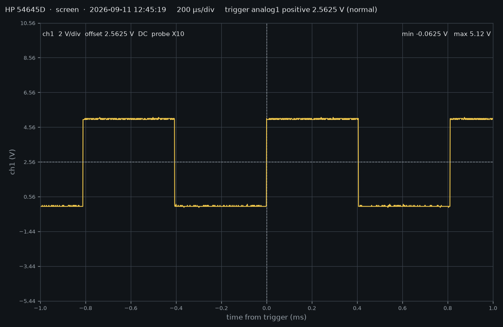

# HP 54645D remote control

Remote control for the HP 54645D mixed-signal oscilloscope over RS-232: read
waveforms (analog and digital, one or several), change settings, and take a
"screenshot" — the data points currently on screen, read without re-arming
the trigger or touching any setting, plotted in Python.

Two parts:

- **`hp54645d`** — a small Python library, usable on its own in any script.
- **A GUI** on top of it — tkinter and matplotlib, nothing else to install.

Written from HP's programmer's guide and checked command by command against a
real 54645D (firmware A.02.08) — see [docs/how-it-works.md](docs/how-it-works.md)
for what the instrument turned out to do that the manual does not say.



## Set up

```bash
git clone https://github.com/DERFunkuchen/HP54645D_remote_control.git
cd HP54645D_remote_control
python -m venv .venv
.venv\Scripts\activate          # Windows; on Linux/macOS: source .venv/bin/activate
pip install -e ".[dev]"
```

No NI-VISA needed: `pyvisa-py` talks to the serial port directly.

On the scope's front panel, in the I/O setup of the RS-232 interface module
(HP 54651A or 54652B, fitted at the rear):

| Setting | Value |
|---|---|
| Interface | *Connect to Computer* (not a printer) |
| Baud rate | 19200 (1200, 2400, 9600 also work — set the same in the tool) |
| Handshake | XON (XON/XOFF) — the only one that works on a 3-wire cable |

## The GUI

```bash
hp54645d-gui          # or: python -m hp54645d
```

Enter the address (`ASRL5::INSTR` is COM5), *Connect*. The form fills with
the scope's current settings.

- **Screenshot** — reads what the screen shows right now, changes nothing.
- **Live** — repeats the screenshot until unticked. Over RS-232 that is about
  0.55 s per channel at 500 points; *Points per channel* trades detail for
  speed (2000 points ≈ 1.2 s per channel). Buttons stay usable: a click is
  run between two frames.
- **View** — *Separate panels* (each channel in volts on its own axis) or
  *One screen* (all channels on one graticule, as on the scope, each at its
  own V/div; switching needs no new readout).
- **Acquire** — takes a fresh single capture of the displayed channels and
  leaves the scope stopped on it.
- **Full memory…** — stops the scope and reads **every stored point**: up to
  a million per analog channel, more than the screen and at the full sample
  rate. A dialog shows each record's size and transfer time (about 9 min for
  a million points at 19200 baud) and lets you choose which to read; you pick
  the file, it is saved as soon as the data is in, and plotted — zoom in with
  the toolbar to see the individual samples. Once started, a transfer cannot
  be interrupted.
- **Apply changes** — sends what you edited, then reads everything back, so
  the form shows what the scope actually has. Numbers take SI suffixes:
  `200u`, `2m`.
- **Run / Stop / Single / Autoscale** — the front-panel keys.
- **Command** — any single command or query, for everything the form lacks.
- **Open file…** — loads a capture saved earlier (`.npz` or CSV) and shows
  it, with no scope needed. The form is not touched, so *Apply* never sends a
  file's settings to the instrument.
- **Measurements** — the table under the plot: min, max, peak-to-peak, mean,
  RMS, frequency, period and duty cycle per channel (time high for logic),
  **over the visible time range**. Zoom or pan and it recomputes — zoom onto
  one edge of a million-point record and read its overshoot off directly.
- **Save data / PNG** — the last capture, as CSV or NumPy `.npz`, or the
  picture.

## The library

```python
from hp54645d import HP54645D, plot_capture

with HP54645D("ASRL5::INSTR", baud_rate=19200) as scope:
    screen = scope.read_screen()                     # nothing changed on the scope

    s = scope.read_settings()                        # edit what you read ...
    s.analog[1].range_v, s.analog[1].offset_v = 16, 2.5
    s.trigger.level_v = 2.5
    scope.apply(s)                                   # ... and only the changes are sent

    fresh = scope.acquire(analog=[1, 2], digital=[0, 1])   # one trigger, all channels
    full = scope.read_memory(analog=[1])                   # every point; minutes

plot_capture(screen, layout="overlay")
full.save("captures/full.npz")

# later, with no scope attached
from hp54645d import load_capture, measure
old = load_capture("captures/full.npz")
print(measure(old, start=-2e-6, stop=2e-6))          # just the edge at the trigger
```

See [docs/library.md](docs/library.md) for the whole API and
[docs/how-it-works.md](docs/how-it-works.md) for how it is built and what the
instrument taught us.

## Layout

```
HP54645D_remote_control/
├─ hp54645d/
│  ├─ transport.py   # the serial line: commands, queries, binary blocks, error queue
│  ├─ settings.py    # settings as dataclasses; the vocabulary; changes()
│  ├─ waveform.py    # preamble maths, traces, Capture, CSV / npz save and load
│  ├─ analysis.py    # measurements: levels, frequency, duty — over any window
│  ├─ scope.py       # HP54645D: the public API
│  ├─ live.py        # LiveReader: repeated readouts that keep up
│  ├─ plot.py        # a capture drawn as a scope screen
│  └─ gui.py         # the window — a client of the library, no instrument logic
├─ examples/         # screenshot.py, acquire.py, full_memory.py
├─ tests/            # no hardware needed
└─ docs/             # library.md, how-it-works.md, manuals/
```

## Checks

```bash
ruff check .
pytest -q
```

The tests use a simulated serial line and need no instrument.

## Licence

[Apache License 2.0](LICENSE): use it, change it, build it into your own
projects, commercial ones included. If you redistribute it or something
derived from it, keep the [NOTICE](NOTICE) file with it — and a link back to
[this repository](https://github.com/DERFunkuchen/HP54645D_remote_control) is
appreciated.

Provided as is, without warranty (see the licence). It talks to real test
equipment; check what it sends before pointing it at anything you care about.

HP, Hewlett-Packard, Agilent and Keysight are trademarks of their respective
owners. This project is independent and not affiliated with or endorsed by
any of them.
